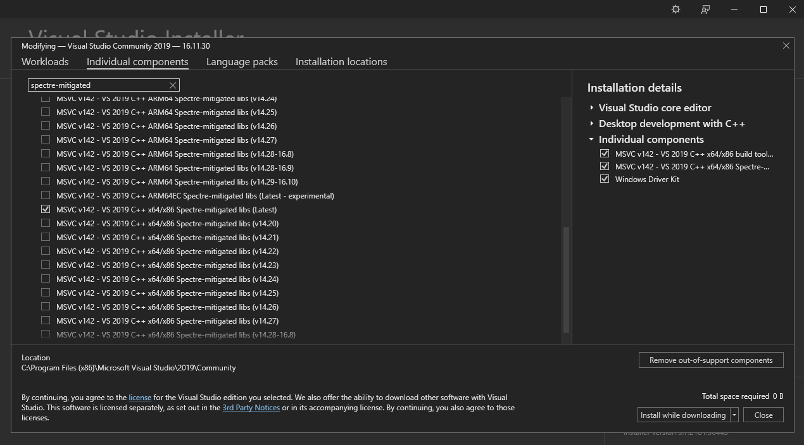

# 🎯 DartFilter 🎯


Anti-Ransomware Kernel Driver

## Table Of Contents

- [Introduction](#introduction)
- [How It Works](#how-it-works)
- [Installation](#installation)
- [Usage](#usage)
- [Dependencies](#build-dependencies)

## Introduction

***DartFilter*** is a Windows Kernel File System Minifilter driver that stops Ransomware activity through a Honeypot detection method, monitoring it's files.

> NOTE: The driver was tested on Windows 10 Education Build 19041 and it's likely to work on new and recent Windows 10 versions.

## How it Works

* ***DartFilter*** intercept every _PreCreateFile_, _PreWriteFile_ and _PreSetFileInformation_ operation on the Honeypot
* Whenever a ransomware or any process tries to perform one of the operations mentioned in our Honeypot, the process gets terminated and returns with an access denied status

## Installation

Here are the installation steps required to load the driver in your system:

### Configure Test Mode

Open PowerShell/Cmd in Administrator mode and run the following command to allow Windows to self-sign Kernel drivers:

```
Bcdedit.exe -set TESTSIGNING ON
```

After running the command, restart the computer and you'll be in Test Mode.

> NOTE: If you wish to turn the Test Mode off, execute the same command with the OFF argument (Bcdedit.exe -set TESTSIGNING OFF)

### Installing DartFilter as a Service

In the "bin" folder on the repository, right-click on the _DartFilter.inf_ file and select the "Install" option.


### Start DartFilter

Now, after installing ***DartFilter***, we must start the service. Opening the PowerShell/Cmd in Administrator mode, run the following command to start or stop the service:

```
sc start DartFilter
```

```
sc stop DartFilter
```

## Usage

To create the Honeypot, make sure to add decoy files in a folder that contains *"_darthoney"* added to it's name. If you'd like to, feel free to download the Honeypot folder in this repository.

## Build Dependencies

- [Windows Driver Kit (WDK)](https://go.microsoft.com/fwlink/?linkid=2166289)
- [Windows SDK](https://developer.microsoft.com/en-us/windows/downloads/windows-sdk/)
- [Build tools for Visual Studio](https://visualstudio.microsoft.com/thank-you-downloading-visual-studio/?sku=BuildTools&rel=16)
  - After installing Visual Studio 2019, click on Modify > Individual Components and Search for "Spectre-mitigated". When done searching, scroll down until we find the "MSVC v142 - VS 2019 C++ x64/x86 Spectre-mitigated libs (latest)", which is another required add-on to build ***DartFilter***

    

### Optional

- [DebugView](https://learn.microsoft.com/en-us/sysinternals/downloads/debugview) to see debug messages of the driver
